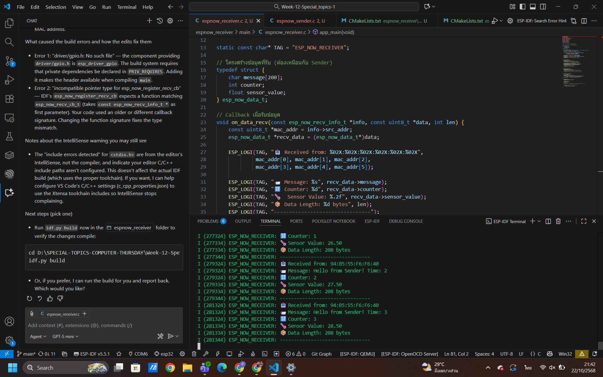
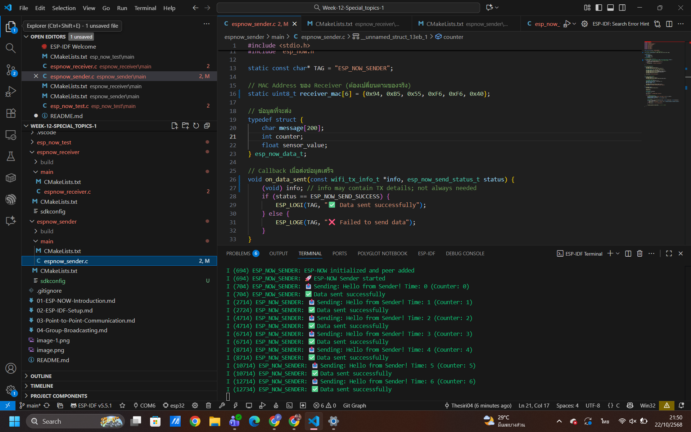
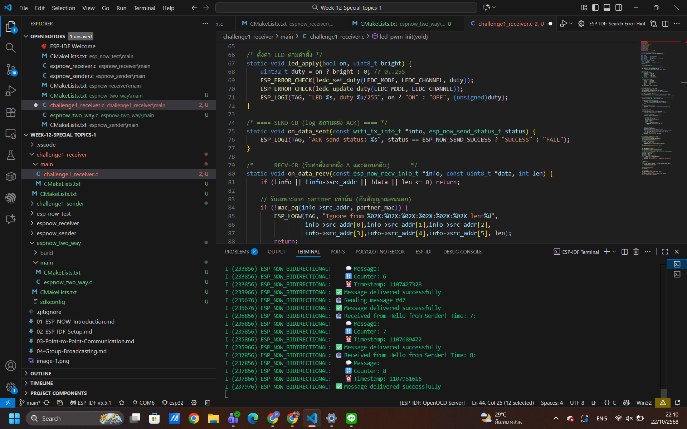
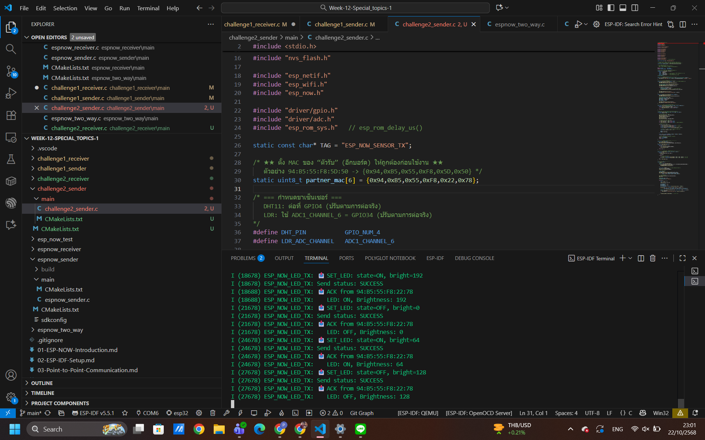
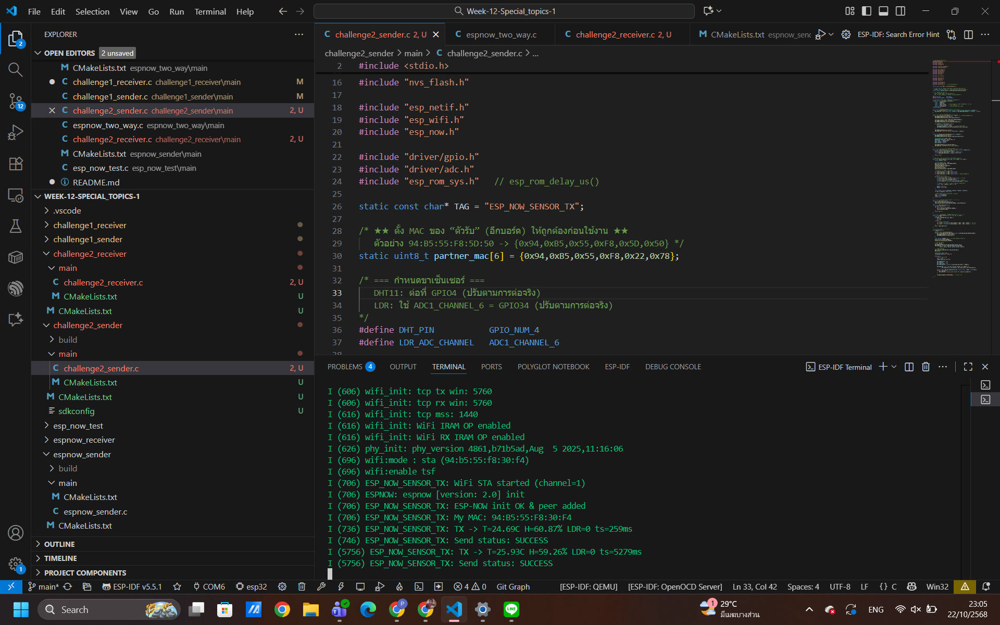
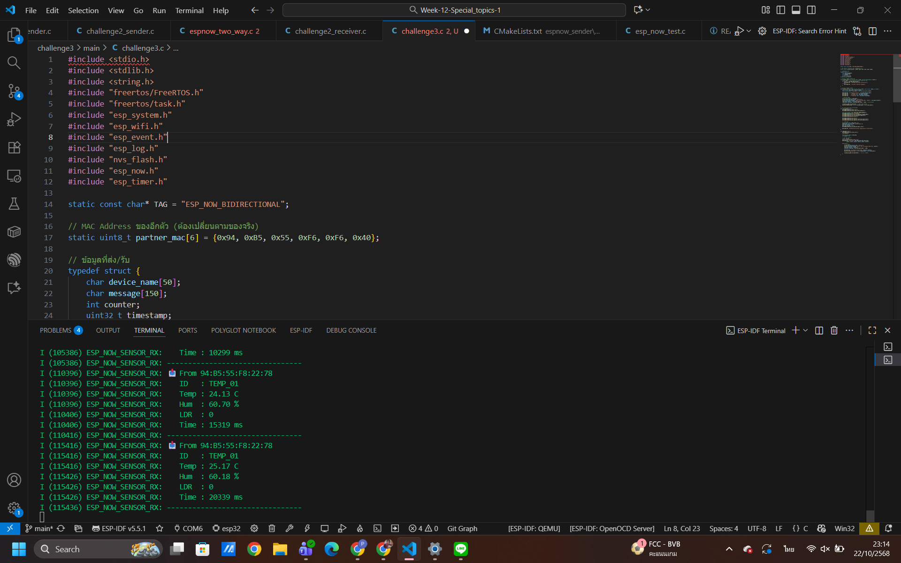
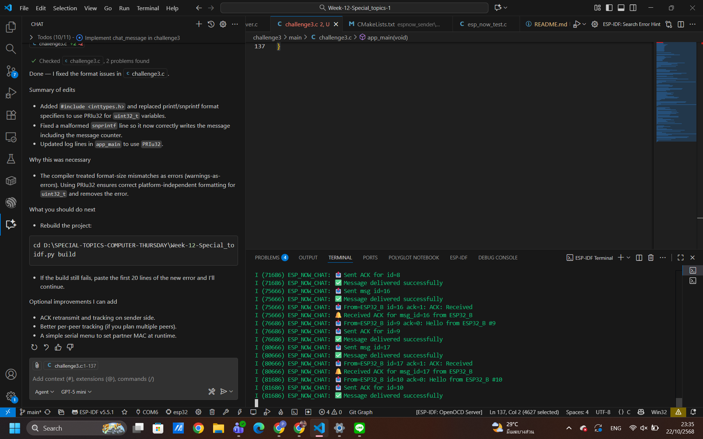
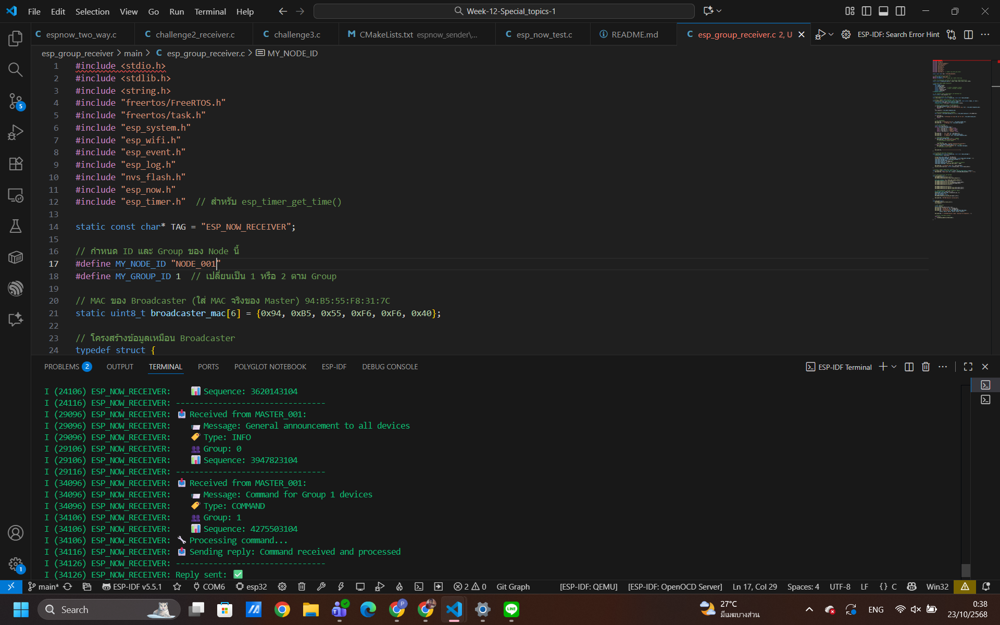
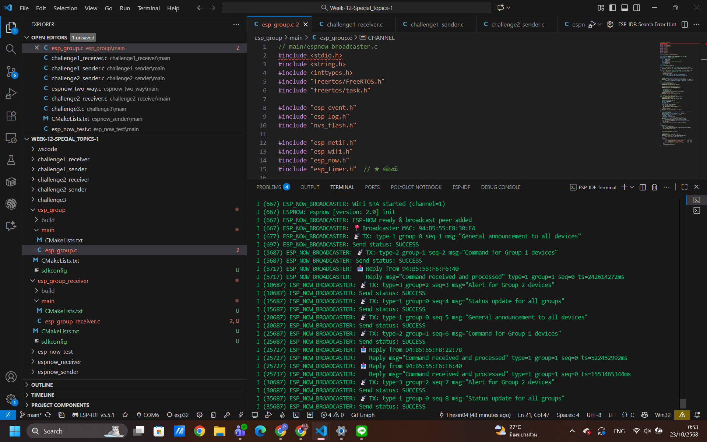

# ESP-NOW สำหรับ ESP32 ด้วย ESP-IDF
1. esp_now_test

 2. espnow_receiver
 
 3. espnow_sender
 
 4. espnow_two-way
 
 5. esp_challenge1_sender
 
 6. esp_challence2_sender
 
 7. esp_challence2_receiver
 
 8. esp_challence3
 
 9. esp_group_receiver
    
10. esp_group_sender
    