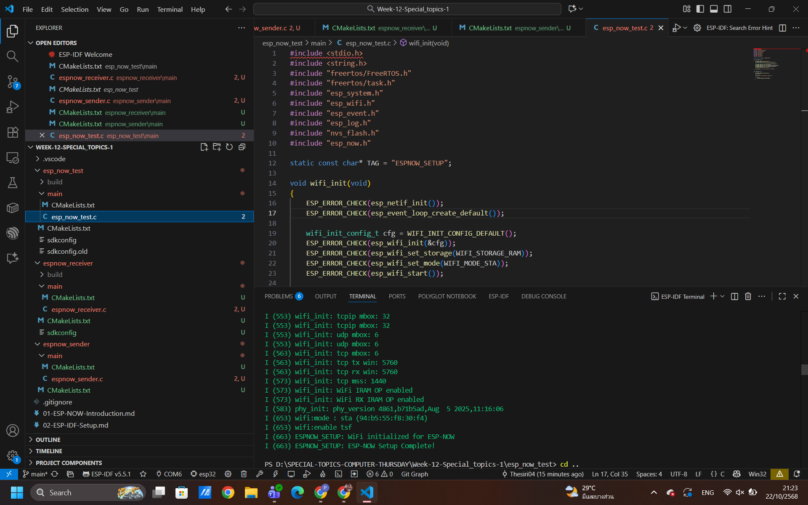

# ESP-NOW สำหรับ ESP32 ด้วย ESP-IDF
esp_now_test

 espnow_receiver
 
 espnow_sender
 
 espnow_two-way
 
 esp_challenge1_sender
 
 esp_challence2_sender
 
 esp_challence2_receiver
 
 esp_challence3
 